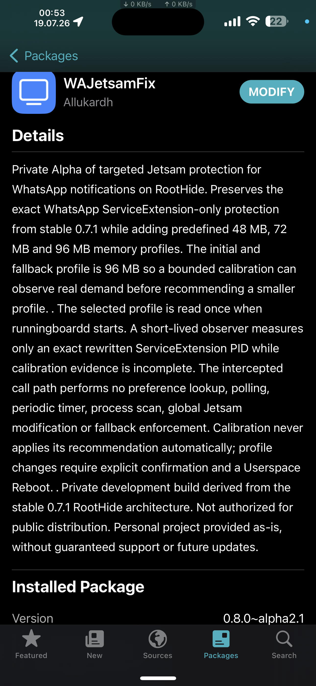
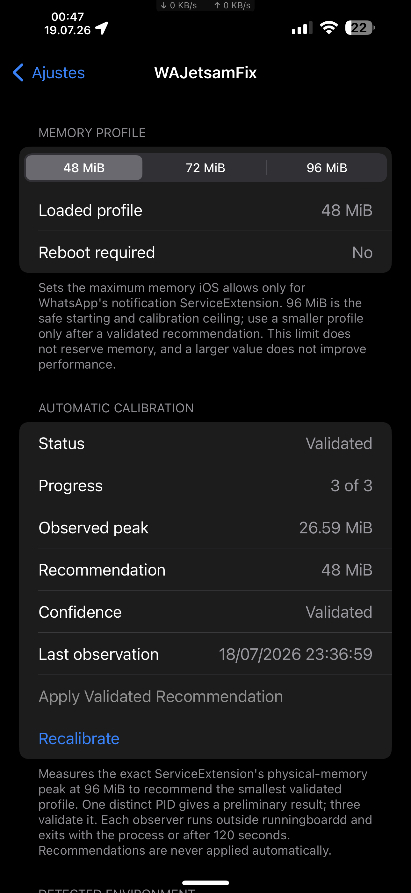
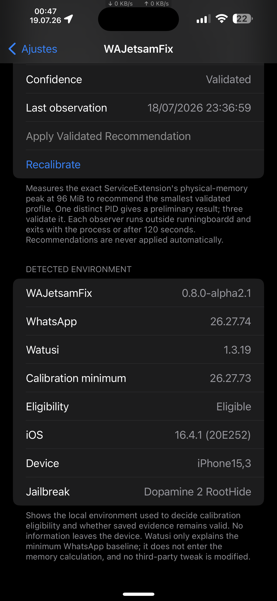

# WAJetsamFix — RootHide 0.8.0 Alpha 2.1 evidence

> [!IMPORTANT]
> This page documents a **private on-device Alpha test**. RootHide 0.8.0 Alpha 2.1 is not a public download, Release or promise of future publication. RootHide Edition 0.7.1 remains the current public stable package.

## What this private build demonstrates

RootHide 0.8.0 Alpha 2.1 preserves the exact WhatsApp notification `ServiceExtension`-only protection architecture proven by stable 0.7.1 while adding:

- predefined 48 MiB, 72 MiB and 96 MiB memory profiles;
- a 96 MiB safe initial and calibration ceiling;
- bounded automatic calibration of the exact rewritten `ServiceExtension` PID outside `runningboardd`;
- a preliminary result after one distinct valid instance and a validated recommendation after three;
- manual application of the smallest validated profile, with explicit confirmation and Userspace Reboot;
- local display of the environment used to determine calibration eligibility and evidence validity.

Calibration never changes the active profile automatically. A larger profile does not reserve memory permanently and does not improve performance by itself.

## Captured test state

Captured on July 19, 2026, after the validated recommendation had been applied manually:

| Item | Captured value |
|---|---|
| WAJetsamFix | 0.8.0-alpha2.1 |
| WhatsApp | 26.27.74 |
| Calibration minimum | WhatsApp 26.27.73 |
| Watusi | 1.3.19, displayed only to explain the compiled WhatsApp minimum |
| iOS | 16.4.1 (20E252) |
| Device | iPhone15,3 |
| Jailbreak | Dopamine 2 RootHide |
| Valid instances | 3 of 3 |
| Highest observed peak | 26.59 MiB |
| Validated recommendation | 48 MiB |
| Loaded profile after manual application | 48 MiB |

The disabled **Apply Validated Recommendation** action shows that the validated 48 MiB recommendation was already loaded. Recalibration remains available for a material environment change, such as a WhatsApp update.

## 1. Installed private package

The package manager identifies the private Alpha build and describes its bounded profile and calibration architecture.

  

## 2. Validated calibration and loaded profile

Three distinct valid `ServiceExtension` instances produced a 26.59 MiB highest observed peak and a validated 48 MiB recommendation. The recommendation was applied manually and is shown as the loaded profile.

  

## 3. Detected calibration environment

Environment information is read locally and is used to determine whether calibration is eligible and whether saved evidence remains valid. It is not transmitted by WAJetsamFix.

Watusi is shown only because its compiled requirement establishes the minimum supported WhatsApp baseline for calibration. It does not participate in the memory calculation, and WAJetsamFix does not modify it.

  

## Evidence scope

These screenshots document the interface and captured state of one private test device. They do not establish universal compatibility, distribute the private package or replace the remaining lifecycle and stabilization gates.

- [RootHide Edition overview](../../README.md)
- [Public roadmap](../../../../shared/ROADMAP.md)
- [Project sustainability](../../../../shared/SUSTAINABILITY.md)
- [Current public RootHide 0.7.1 Release](https://github.com/Allukardh/WAJetsamFix-Release/releases/tag/v0.7.1)
